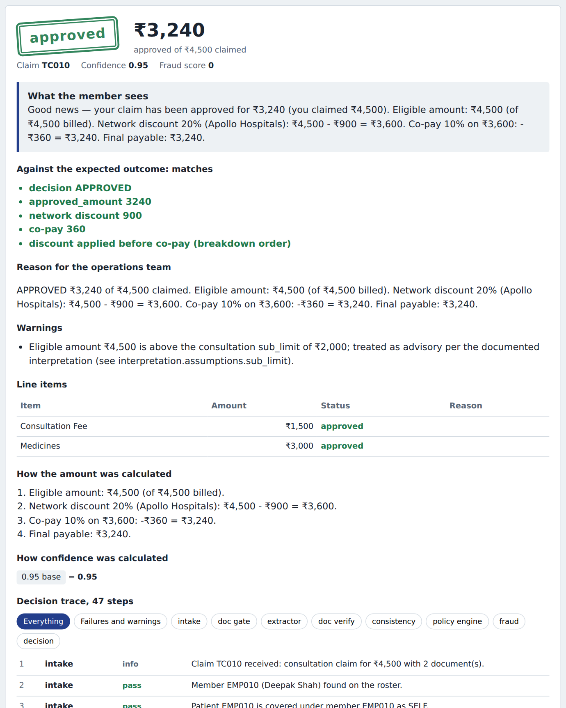
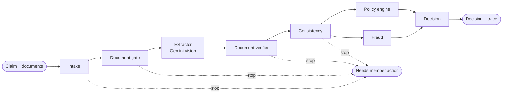
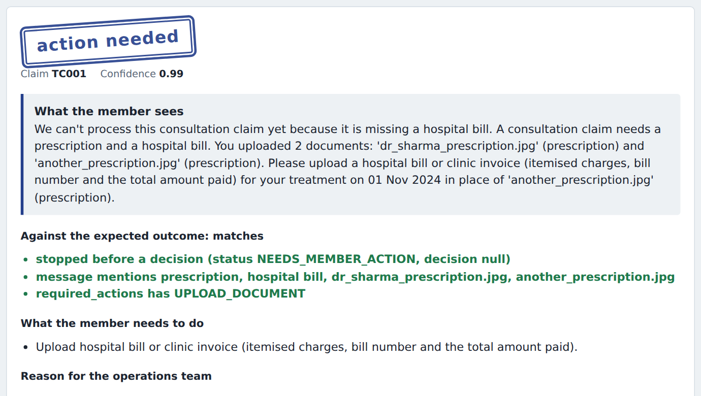
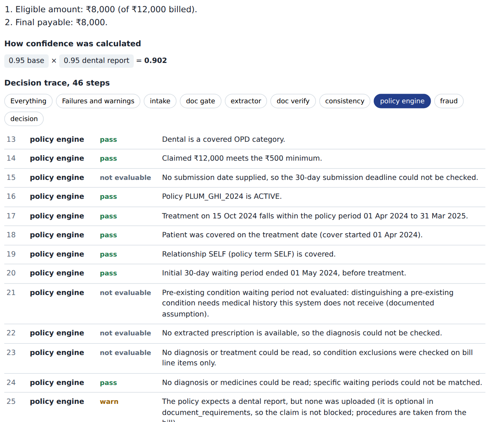

# Plum OPD Claims Engine

**Automated health-insurance claim adjudication: a vision model reads the documents, deterministic code applies the policy, and every decision comes with a step-by-step trace.**

[](https://github.com/nandy2uy/plum-claims-engine/actions/workflows/tests.yml)




A member submits an OPD claim (consultation, pharmacy, dental, diagnostics…) with photos of their prescription and bills. The engine checks the documents are the right ones, reads them, applies the policy in [`data/policy_terms.json`](data/policy_terms.json), and returns **APPROVED, PARTIAL, REJECTED or MANUAL_REVIEW** with the amount, the reason, a confidence score and a full decision trace. If the documents themselves are the problem, it stops before deciding and tells the member exactly what to fix.

| | |
|---|---|
| **Assignment test cases** | 12 / 12 pass strict checks, with full traces in [EVAL_REPORT.md](EVAL_REPORT.md) |
| **Automated tests** | 144, covering every agent, the LLM client, the API and the 12 cases |
| **Live extraction** | Gemini on six rendered medical documents, results in [docs/LIVE_EXTRACTION.md](docs/LIVE_EXTRACTION.md) |
| **Design docs** | [ARCHITECTURE.md](ARCHITECTURE.md) and [COMPONENT_CONTRACTS.md](COMPONENT_CONTRACTS.md) |

## How it works



The core rule: **the model reads, code decides.** The vision model only classifies documents, judges their readability and extracts fields into a strict schema. Eligibility and payout are deterministic code driven entirely by the policy file, so every decision is reproducible and every rule it checked is in the trace.

| Agent | Job |
|---|---|
| **Intake** | Resolves the member and patient and checks the patient belongs to that member; computes when cover started |
| **Document gate** | Checks the right document types were uploaded, before any model call |
| **Extractor** | One Gemini call per document, in parallel: classify, assess quality, extract. Tells member-fixable problems apart from system faults |
| **Document verifier** | Re-checks requirements against what the model actually saw; asks for re-uploads of specific unreadable files |
| **Consistency** | Confirms every document names the same patient (a shared surname is not enough) |
| **Policy engine** | Every policy rule, per-line adjudication, limits and the payout calculation, each logged with its policy clause |
| **Fraud** | Frequency, value, duplicate-document and tampering signals (runs in parallel with the policy engine) |
| **Decision** | Combines everything into the final decision, confidence breakdown, ops reason and member message |

Every stage has a timeout and a declared criticality. A failed component never crashes a claim: it is logged, confidence drops, and the claim goes to a human when the missing check matters.

## What it looks like

**Stopping early with an actionable message.** Two prescriptions were uploaded for a consultation that needs a prescription and a hospital bill:



**A trace an operations reviewer can follow.** Every rule is logged, including the ones that passed and the ones that could not be evaluated, with the policy clause it checked:



## Design decisions worth knowing

- **The model can raise a question but never deny a claim.** It proposes condition tags from a closed vocabulary built from the policy; a tag without a keyword match routes the claim to manual review, never to rejection.
- **Confidence is reconstructable.** It is the base extraction confidence multiplied by factors that are each recorded in the trace, so you can recompute the score by hand.
- **Member fault vs system fault.** A blurry photo asks the member to re-upload that file; an outage on our side goes to manual review and is never blamed on the member.
- **Ambiguous policy clauses are data.** How the engine reads unclear rules (for example, what a category sub-limit means) lives in [`data/interpretation.json`](data/interpretation.json) with the reasoning, and is cited by the trace.
- **Unsafe caller inputs are gated.** Pre-extracted document data and simulated component failures only work when explicitly enabled.

The full reasoning, alternatives that were rejected, limitations and the plan for 10x load are in [ARCHITECTURE.md](ARCHITECTURE.md).

## Run it

Python 3.11+.

```bash
python -m venv venv
source venv/bin/activate            # Windows: .\venv\Scripts\Activate.ps1
pip install -r requirements.txt
cp .env.example .env                # Windows: copy .env.example .env
uvicorn src.main:app --reload
```

Open http://127.0.0.1:8000.

- **Test cases** tab: runs any of the 12 assignment cases through the real pipeline and shows the decision, the check against the expected outcome, and the trace. No API key needed.
- **New claim** tab: upload real images or PDFs. Needs `GEMINI_API_KEY` in `.env` (free from Google AI Studio). Any file in [`samples/`](samples/) works.

To use OpenAI instead of Gemini, set `LLM_PROVIDER=openai` and `OPENAI_API_KEY`.

## Test and evaluate

```bash
pytest                                  # 144 tests
python scripts/run_evals.py             # the 12 assignment cases with strict checks
python scripts/generate_eval_report.py  # regenerates EVAL_REPORT.md
python scripts/make_samples.py          # renders the mock documents in samples/
python scripts/run_live_samples.py      # real Gemini extraction on them -> docs/LIVE_EXTRACTION.md
```

## API

```bash
curl -s localhost:8000/api/v1/claims -H 'content-type: application/json' -d '{
  "member_id": "EMP010", "category": "CONSULTATION", "treatment_date": "2024-11-03",
  "claimed_amount": 4500, "hospital_name": "Apollo Hospitals",
  "documents": [
    {"file_id": "F1", "file_type": "PRESCRIPTION", "pre_extracted_data": {"prescription_data": {
       "patient_name": "Deepak Shah", "doctor_registration": "TN/56789/2013", "diagnosis": "Acute Bronchitis"}}},
    {"file_id": "F2", "file_type": "HOSPITAL_BILL", "pre_extracted_data": {"bill_data": {
       "patient_name": "Deepak Shah", "hospital_name": "Apollo Hospitals",
       "line_items": [{"description": "Consultation Fee", "amount": 1500}, {"description": "Medicines", "amount": 3000}]}}}
  ]}'
```

Returns `APPROVED` for ₹3,240: the 20% network discount (₹900) is applied before the 10% co-pay (₹360). Real uploads use `content_base64` + `mime_type`, or the multipart endpoint `/api/v1/claims/upload`. The `pre_extracted_data` fixture path shown here requires `ALLOW_FIXTURE_DOCUMENTS=true`, which `.env.example` sets for local use.

| Endpoint | Purpose |
|---|---|
| `POST /api/v1/claims` | Submit a claim as JSON |
| `POST /api/v1/claims/upload` | Submit a claim with real files (multipart) |
| `GET /api/v1/claims/{id}` | A decision with its full trace |
| `GET /api/v1/test-cases`, `POST /api/v1/test-cases/{id}/run` | The 12 assignment cases |
| `GET /health` | Policy version, active model, integrity warnings |

## Project layout

```
src/agents/    intake, doc_gate, extractor, doc_verifier, consistency, policy_engine, fraud, decision
src/core/      orchestrator, fault tolerance, vision client, storage, config, text helpers
src/models/    claim, extraction, policy and trace data models
src/evals/     test-case adapter, strict checks, report renderer, mock documents
data/          policy_terms.json, interpretation.json, test_cases.json
static/        the UI
tests/         pytest suite
scripts/       evals, eval report, sample documents, live extraction
samples/       rendered mock documents and live results
```

## Known limitations

In-memory storage, no authentication yet, keyword-based clinical matching with a simple negation check, and a few rules that need data the system does not receive (pre-existing conditions, pre-authorisation validity). Each is described, with what would replace it, in [ARCHITECTURE.md](ARCHITECTURE.md#8-limitations-of-the-current-design).
